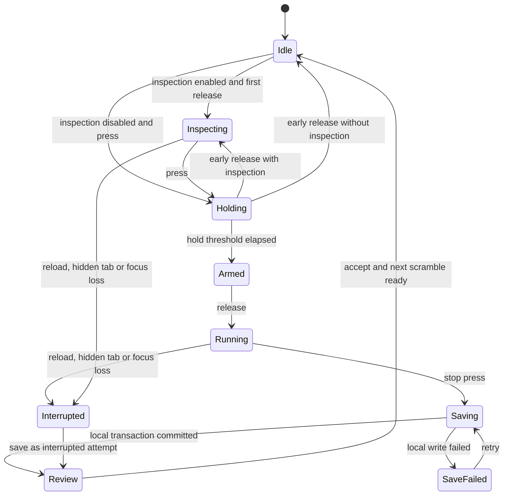

# System architecture and decisions

## Technology decisions

| Layer | Reference decision | Adoption boundary |
| --- | --- | --- |
| Language | TypeScript with strict checking, unchecked-index checking and exact optional properties for new domain modules | M1; leave legacy JavaScript behind explicit adapters until migrated |
| Web UI | React with Vite and CSS custom properties; semantic HTML components | M2 app shell; current Rollup page stays functional through migration |
| Rendering | Three.js behind a renderer port | Keep vendored version initially; pin and upgrade only after regression tests |
| State | Pure domain commands/reducers; local view state in components; external store for timer/cube | No server or framework types in domain packages; high-frequency frames bypass React renders |
| Local data | IndexedDB for practice records; local storage for preferences and the bounded M2 cube checkpoint | M1 transactions retained; M2 checkpoint exception and future repository migration documented in release notes |
| Background compute | Dedicated Web Workers; WASM only when a measured engine requires it | Solver, scramble tables and later vision; lazy-loaded and cancellable |
| API | Node.js maintained LTS, Fastify modular monolith, JSON Schema contracts | M5; one deployable API and a separately runnable job process |
| Cloud data | Managed PostgreSQL; SQL migrations and parameterized queries | M5; no browser DB credentials, tenant ownership in every request |
| Identity | Managed OIDC/OAuth provider behind an identity adapter | Vendor selected before M5 after provider, region, export, deletion and pricing review |
| Jobs/assets | PostgreSQL job table plus worker; S3-compatible private object storage | M5; add Redis only if queue/rate-limit measurements justify it |
| Mobile | Capacitor wrapping the web app, native storage/camera adapters as needed | M8; Flutter only if a device spike establishes a requirement that this approach cannot meet |
| Desktop | Tauri wrapper with narrowly scoped commands | M8; platform signing and upgrades tested separately |
| Repo | npm workspaces as packages are extracted, one lockfile, explicit package exports | M1; no task orchestrator until build times justify one |

These are project decisions, not claims that a particular framework is universally best. Exact dependency versions are selected and locked at implementation time. TypeScript's strict setting enables a family of stronger checks; Vite documents its build/dev workflow. [TypeScript](https://www.typescriptlang.org/tsconfig/strict.html), [Vite](https://vite.dev/guide/), [Fastify](https://fastify.dev/docs/latest/).

## Target repository

```text
apps/
  web/                     # React PWA; public lesson routes, simulator and timer
  api/                     # account/sync/content/community module composition
  jobs/                    # exports, deletion, moderation and optional coaching
  mobile/                  # Capacitor platform projects, introduced in M8
  desktop/                 # Tauri platform projects, introduced in M8
packages/
  cube-core/               # integer state, notation, moves, legality, solved predicate
  timing/                  # clock port, attempt state machine, penalties
  statistics/              # ordering, trimming, PBs and versioned definitions
  training/                # lesson/case evaluation and drill selection
  contracts/               # boundary schemas, worker and sync messages
  storage/                 # repository ports, IndexedDB and native adapters
  renderer-three/          # geometry, interpolation, hit testing, device controls
  ui/                      # accessible components and design tokens
  content/                 # reviewed lessons/cases and provenance
  solver/                  # engine adapter, tables, worker entry, result verifier
  vision/                  # face capture, color classification and confidence
docs/architecture/
tests/                     # integration, fixtures and cross-app end-to-end journeys
```

Only create a package when code is extracted into it. Each has one owner, public exports and tests. `cube-core`, `timing`, `statistics` and `training` cannot import React, Three.js, IndexedDB, HTTP clients or server modules. Storage and UI depend inward on their ports. API adapters map contracts to application services; they never import a browser component.

## Cube and renderer contracts

Use an immutable integer state as the long-term source of truth. State serialization declares a puzzle (`222`, `333`, `444`, `555`), schema version, facelet convention and orientation. For 3×3, define faces in URFDLB order, row-major when looking directly at each face from outside. Publish golden front/back/top orientation diagrams and known scramble fixtures before adding scanner input. A 3×3 cubie adapter handles corner/edge permutation and orientation checks. Other sizes use dedicated models and validators; do not reuse 3×3 parity rules blindly.

```ts
type Move = { face: 'U'|'R'|'F'|'D'|'L'|'B'; layers: number; turns: 1|2|3 };
type StateEnvelope = { schemaVersion: 1; puzzle: '222'|'333'|'444'|'555';
  convention: 'URFDLB-v1'; facelets: string };
interface CubeEngine {
  validate(input: unknown): ValidationResult<StateEnvelope>;
  apply(state: StateEnvelope, moves: readonly Move[]): StateEnvelope;
  isSolved(state: StateEnvelope): boolean;
}
interface RendererPort {
  setState(state: StateEnvelope): void;
  animate(before: StateEnvelope, move: Move, after: StateEnvelope): Promise<void>;
  resize(width: number, height: number): void;
  dispose(): void;
}
```

This is a boundary sketch; supporting result types belong in `contracts`. State validation checks format, piece counts and puzzle-specific reachability, not just nine stickers of each color. Future slice/wide/rotation notation is parsed into canonical operations; document whether rotations change the frame of reference or the logical puzzle. Screen-space dragging is translated using that same frame.

Application flow: validate command → enqueue bounded move → apply logical transition → request visual interpolation → commit the visible checkpoint and emit move-completed → save. During playback, disable conflicting pointer commands. A reduced-motion renderer resolves immediately. On interrupted animation, snap to the authoritative state; never persist partial geometry. Queue limit starts at 32, with visible feedback on overflow; tune against measured typing without silently discarding accepted commands.

Persist only a stable logical checkpoint and explicitly approved pending commands. The existing geometric saved game is supported by a legacy loader until a verified conversion exists. Never approximate an uncertain legacy state: retain its backup and offer legacy resume or an explicit reset.

## Timer state machine



The initial inspection release is a dedicated action; its matching key-up must not also start a solve. Record the state that preceded Holding, and evaluate inspection elapsed time only when starting. An over-limit inspection ends as DNF, without entering Running. Escape cancels holding/inspection only with explicit state handling; a running solve becomes interrupted. Stopping key-up cannot re-arm the next attempt. Ignore auto-repeat, IME, browser shortcuts and editable targets. Pointer capture and `pointercancel` follow equivalent transitions. The timer route owns Space only while its pad is active.

Use an injected monotonic `Clock.now()` for duration and `Date.now()` only for calendar metadata. Freeze configuration at attempt start. Save elapsed integer milliseconds, not floating formatted strings. Rendering ticks never accumulate elapsed time. On reload, do not subtract performance timestamps from another document. Hidden/frozen/reloaded attempts become interrupted and are excluded from PBs unless the user explicitly records a manual result. Browser sleep behavior varies, so a monotonic clock alone is not a background timing guarantee. [MDN performance.now](https://developer.mozilla.org/en-US/docs/Web/API/Performance/now).

Timing rule profile `practice-wca-2026-04`: inspection under 15,000 ms has no penalty, 15,000–16,999 ms adds 2,000 ms, and 17,000 ms or more is DNF. These boundaries follow A4d1/A4d2; this app remains a practice timer, not an official timing certification. Penalties can accumulate, so store `penaltyMs` as a nonnegative multiple of 2,000 plus an independent outcome. Record rule version and adjustment reason. [WCA Regulations](https://www.worldcubeassociation.org/regulations/#A4d1).

Statistics profile `practice-trimmed-v1`: order results by effective time with DNF worst; for a rolling N, trim `ceil(N * 0.05)` from each end; require N eligible attempts; a remaining DNF makes the result DNF. Thus Ao5 trims 1+1, Ao12 trims 1+1, Ao100 trims 5+5. WCA's Ao5 removes the best/worst and permits only one DNF; Ao12/Ao100 here are explicitly product practice definitions. Preserve integer sums and round only for display. Exclude interrupted/deleted attempts, retain legitimate DNFs, and break equal-time ordering with stable attempt order. [WCA average rules](https://www.worldcubeassociation.org/regulations/#9f8).

## Solver, learning and camera

The solver worker accepts `{requestId, state, stateHash, engineVersion, method, deadlineMs}`. Validate state before computation. Return moves, method actually used, engine version and input hash. Apply returned moves with `cube-core`; display only if solved and the user has not changed the input. A canceled/timed-out worker is terminated or cooperatively aborted. Tables are versioned/lazy downloaded and checksummed; an absent offline engine prompts a download when online. Workers keep computation away from DOM rendering. [Worker model](https://developer.mozilla.org/en-US/docs/Web/API/Web_Workers_API/Using_web_workers).

Start with a licensed, deterministic 3×3 engine evaluated through fixtures and device benchmarks. An efficient generic solution is not automatically a beginner/CFOP/Roux/ZZ lesson. Method-specific steps need their own solver/content validation. The trainer uses validated inverse setup sequences and an orientation-aware allowed-action model; lesson text and algorithms carry revision and provenance.

Scanner pipeline: request camera on explicit action → guide face orientation → detect grid → collect multiple-frame color samples → classify locally → attach per-sticker confidence → show correction grid → reconstruct/validate → solve. Start with guided fixed-grid capture and conventional color processing; introduce OpenCV/WASM or a learned model only after a benchmark demonstrates the need. Low confidence is a correction request, not guessed state. Stop camera tracks when leaving the scanner or losing ownership. Permission denial/no camera retains manual entry. HTTPS and user permission are required for camera access. [getUserMedia](https://developer.mozilla.org/en-US/docs/Web/API/MediaDevices/getUserMedia).

The live assistant initially advances on user confirmation. Automatic move recognition is an experiment with orientation tracking, uncertainty thresholds and recovery; it cannot be implied by static scanning. Voice uses move IDs and localization, pauses with playback and has a mute control.

## Backend, coaching and native boundaries

API modules: identity/profile, practice/sync, content/progress, collection, sharing/clubs, moderation, competitions, coaching and billing. Each owns tables and application services. Cross-module work uses explicit calls or transactional outbox events, not direct writes to another module's tables. Run async exports and external-provider tasks in a job process with idempotency, leases, retries and dead-letter review. Introduce microservices only for proven isolation/scaling needs.

Coaching starts with deterministic recommendations on recorded data. Recognition time requires a recognition drill; F2L splits require explicit splits or reliable move telemetry. The optional LLM receives a minimized summary and approved lesson IDs, returns a structured suggestion citing evidence, and cannot edit scores or produce authoritative cube states. Apply provider limits, consent, retention and cost caps on the server. No model credentials in the web bundle.

Capacitor and Tauri reuse web features but provide separate permission/storage/upgrade adapters. Browser IndexedDB does not automatically transfer between an installed shell and a browser: import or authenticated sync connects them. Use OS credential storage for native refresh credentials and allowlist native capabilities. Each operating system still needs device QA, signing and distribution work. [Capacitor](https://capacitorjs.com/docs), [Tauri](https://v2.tauri.app/start/).

## Decision records

| ID | Decision | Alternative deferred / consequence |
| --- | --- | --- |
| ADR-001 | Incremental migration preserving the legacy entry point | Big-bang rewrite risks game/data regressions |
| ADR-002 | Typed pure domain before UI rewrite | Broad permissive declarations would hide invalid state |
| ADR-003 | React/Vite interaction shell | Next.js is reconsidered only for demonstrated server rendering/content needs; public lessons get static HTML output and metadata |
| ADR-004 | Local-first persistence and optional identity | Account-required usage would make practice depend on network availability |
| ADR-005 | Modular monolith and PostgreSQL | Multiple services/Redis are operational costs without measured need |
| ADR-006 | Deterministic solving with independent verification | LLM-only solving has no correctness guarantee |
| ADR-007 | Shared web code for native shells | Flutter introduces a second UI/domain integration; require a device spike before choosing it |
| ADR-008 | Explicit conflicts with version preconditions | Device-clock last-write-wins can silently lose edits |
| ADR-009 | Push each verified change set to `main`; preserve original `master` | Successful web checks deploy the tested artifact to GitHub Pages; native releases remain separate |

## Migration sequence

1. Extract timing/statistics packages and their tests while keeping the existing build and page.
2. Add transactional storage/import behind a port. Keep a read-only backup of legacy keys.
3. Add the physical timer as an isolated route/entry. Resolve legacy global lifecycle and disposal before mounting in a React shell.
4. Implement `cube-core` and compare known logical states to the legacy renderer; only then switch game authority from geometry.
5. Move the build to Vite once both routes and the existing relative-path PWA behavior pass regression tests. Retain a rollback artifact.
6. Add learning/solver/trainer through those ports, then accounts/sync. Move directories into the target workspace gradually with import boundaries enforced in CI.
