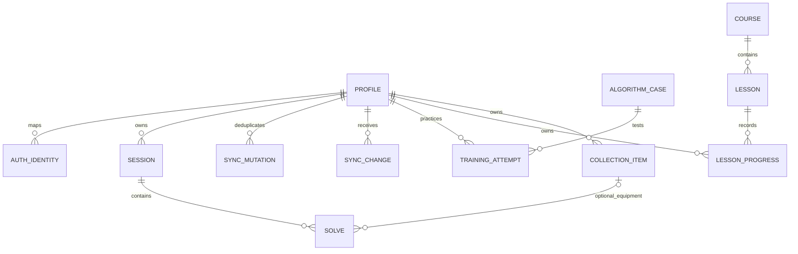

# Data model, migration and synchronization

## Shared value conventions

Entity IDs and mutation IDs are client-generated UUIDs. API dates are ISO 8601 UTC strings; durations are nonnegative integer milliseconds capped at 86,400,000 for the initial practice product. The cap is a product input bound, not a competition rule. Profiles identify users by internal ID; external identities are mapped by `(issuer, subject)`, never by email alone.

An attempt stores `outcome` (`ok`, `dnf`, `interrupted`), nullable `elapsedMs`, cumulative `penaltyMs`, puzzle, mode, input source, rule version, device ID, device sequence and performed time. `ok` requires elapsed time. Penalties are multiples of 2,000 ms. DNF is not serialized as Infinity or an arbitrary large duration. Preserve raw duration and derive effective time. `interrupted` is excluded from averages/PBs unless explicitly converted to a manual record. DNS is reserved for future organized competition data and is not silently mixed into practice.

Session puzzle/mode are immutable after creation. Moving solves requires an explicit migration/copy operation into a compatible session; imported unknown metadata remains unknown. Stable practice display/statistics order is `(performedAt, deviceId, deviceSequence, id)`, with user-visible date correction supported later. It is a deterministic personal history order, not proof of when a competitive solve occurred. Feed order is a separate server-controlled sequence.

## Logical model

The [reference SQL](schema.sql) covers private profiles, identity mapping, sessions, solves and synchronization infrastructure. Extension tables below are a data dictionary for later migrations, not hidden functionality in that schema.

| Entity/module | Fields and relationships | Required constraints/indexes |
| --- | --- | --- |
| Profile/identity | id, displayName, locale, optional country/WCA ID, issuer/subject, deletion state | Unique issuer+subject; WCA link unverified until identity checks; private by default |
| Session | id, ownerId, title, puzzle, mode, archivedAt, version | Index `(ownerId, updatedAt, id)`; title length; immutable puzzle/mode |
| Solve | id, ownerId, sessionId, raw time/outcome/penalty, scramble and provenance, device sequence, rule version | Composite ownership FK; index `(ownerId, sessionId, performedAt, id)`; penalty and elapsed checks |
| SolveRevision | solveId, actorId, before/after changed fields, reason, serverAt | Append only; edits invalidate/recompute derived statistics; restrict access to owner/moderator where appropriate |
| AlgorithmCase/Variant | id, puzzle, method/set, case code, setup, algorithm, orientation, provenance, contentVersion | Unique stable case code per puzzle/set; verifier version and license required |
| Course/Lesson/Step | id, order, localized text, setup state, allowed actions, prerequisites, contentVersion | Publish only reviewed content; no arbitrary executable script from content |
| TrainingAttempt | ownerId, caseId, contentVersion, recognitionMs, executionMs, outcome, timestamp | Index owner/case/time; recognition and execution remain separate nullable measures |
| LessonProgress | ownerId, lessonId, contentVersion, step, completedAt | Unique owner+lesson+contentVersion; completion is evidence-based, not untrusted client awards |
| CollectionItem/Maintenance | ownerId, label, brand/model, setup attributes, purchase date optional; maintenance date/note | Owner FK, bounded structured notes; avoid forcing a commercial product catalog |
| Follow/Block | followerId, targetId, state, createdAt | Unique pair; no self-follow; blocks enforced across search, feeds and invites |
| Club/Membership | clubId, ownerId, visibility; userId, role, state | Unique club+user; roles owner/moderator/member; no client-written role escalation |
| Post/Report/ModerationAction | authorId, body/media refs, visibility; reporter, reason, target; moderator decision | Report rate limits; content status; audit trail; media scanned before publication |
| Challenge/Entry | puzzle, scramble-set version, window, rules; entrant, attempt refs, trust class | Server window checks; immutable submitted snapshot; unique entrant+round+attempt |
| WcaProfileSnapshot/Competition | external ID, source URL, fetchedAt, etag, licensed fields | Cache version, freshness label; never copy official results into self-reported trust class |
| CoachPlan/Recommendation | ownerId, input-summary hash, evidence refs, model/config version, expiry, accepted state | No inferred split metrics without evidence; quota and feedback fields |
| Entitlement/BillingEvent | ownerId, feature, source, validity interval; provider event ID/hash | Provider event dedup; server-calculated entitlements; no card data in app DB |
| Device/PushSubscription | ownerId, device public identifier, provider endpoint, consent, revokedAt | Encrypt subscription secrets; unsubscribe/revoke; quiet-hour preferences |
| ExportJob/DeletionJob | ownerId, type, status, lease, attempts, output object, expiry | Idempotency key; private object; job timeout and retry budget |

## Local storage

Use one IndexedDB database per namespace: guest installation or authenticated internal user ID. Store `meta`, `sessions`, `solves`, `outbox`, `conflicts`, `migrationBackups`, `contentManifests`, `lessonProgress`, `trainingAttempts` and `settings` as adopted. Index solves by session/order and outbox by next-retry time. A transaction writes the solve and its outbox mutation together, so a reload cannot produce an uploaded-but-unrecorded attempt. IndexedDB provides asynchronous structured storage and transactions. [MDN IndexedDB](https://developer.mozilla.org/en-US/docs/Web/API/IndexedDB_API).

Cache Storage holds versioned app/content/engine assets, not the authoritative solve database. Browser storage can be cleared or evicted: provide export, quota/error handling and persistent-storage requests where supported. An offline badge must distinguish saved locally, waiting to sync, synchronized, conflict and save failed.

## Legacy migration and backup

1. Read legacy keys without modifying them. Save their exact values, storage version and a checksum in a migration backup; validate before use.
2. Parse supported cube sizes and finite times. Quarantine invalid records with reasons. Preserve lifetime solve count/best/worst separately as `legacySummary`: retained individual records cannot reconstruct already-trimmed history.
3. Create one imported simulator session per size. Preserve the source index with a deterministic migration ID so retries cannot duplicate records. Unknown scramble, date or penalty remains nullable with `source=legacy`; do not invent timestamps or inspection data. The API's ordinary new solve input requires a performed time, so legacy import uses a dedicated future import contract rather than faking normal timer input.
4. Commit imported records, summary and migration marker atomically. Read back counts/checksums and compare aggregates. If validation fails, keep using the prior data with a clear error.
5. Keep the legacy geometric saved game resumable until its state conversion is independently tested. Do not delete original keys or increment the old game version as an incidental part of a new deployment.
6. Export first; perform destructive cleanup only in a separate, reversible migration with user-visible impact.

Backup envelope: `{format:"the-cube-backup", schemaVersion:1, exportedAt, applicationVersion, sessions, solves, settings, legacySummaries, contentProgress, checksums}`. Define deterministic serialization for checksums; checksum integrity is not authenticity. Import limit starts at 10 MiB/100,000 records, processed incrementally. Preview counts/conflicts, validate every record and reference, reject unsupported versions, then commit all or none. File names and strings are data, never HTML or code. Export includes a compatibility manifest so future clients can upgrade known schemas.

## Authenticated sync v1

The v1 contract synchronizes sessions and ordinary practice solves only. Legacy imports, content progress and collection sync are later extensions. All paths derive `ownerId` from authenticated identity; clients cannot choose it. Endpoint shapes are in [API contracts](04-api.md) and [OpenAPI](openapi.json).

**Push:** a local command creates a UUID mutation with entity type/id, operation (`upsert`/`delete`), baseVersion and full proposed data. Create uses baseVersion 0. Existing edits/deletes require the server's version. Submit up to 100 mutations/256 KiB, parent session before dependent solve. Process each mutation atomically in input order; partial success is explicit and is not presented as a whole-batch transaction.

Within each mutation transaction: lock the owner's sync-head row → check `(ownerId, mutationId)` receipt and request hash → validate ownership/precondition → mutate entity/increment version → increment the locked per-owner feed sequence → insert change and receipt → commit → acknowledge. REST writes use the same service and feed. This per-owner serialization prevents a later-committed lower sequence from being skipped by a cursor. A plain auto-increment sequence without commit ordering is insufficient. PostgreSQL transactions and explicit locking must be tested under concurrent writes. [PostgreSQL isolation](https://www.postgresql.org/docs/current/transaction-iso.html).

An identical retried mutation returns its recorded outcome. Reusing its ID with different bytes produces `mutation_id_reused`; it never re-executes. Canonicalize request JSON before hashing. Successful receipts are retained at least 90 days; after expiry, entity versions still prevent duplicate creates/replayed updates, but clients may have to reconcile through pull. A delete repeated with its already-used mutation ID returns the original receipt. New attempts to recreate a deleted ID are rejected.

**Pull:** return changes after an opaque, owner-bound cursor. Decimal-string sequence values avoid JavaScript integer precision loss. Each response captures a fixed upper watermark, pages in sequence order and returns the next cursor. Persist applied rows and cursor in one local transaction. The feed retains 30 days of payloads; expired cursors return 410 and require a snapshot. These retention periods are proposed defaults to review before accounts launch.

**Snapshot:** the first request creates an owner-bound immutable view of current sessions/solves at watermark W, under a consistent transaction snapshot. Store its pages privately with a 15-minute token. Read pages into a staging local database, then atomically replace synchronized base data and adopt W; preserve the pending outbox/conflicts. Continue pulling after W. An expired snapshot restarts; never assemble unrelated live pages as one snapshot.

**Conflicts:** changed baseVersion returns current server state/version (or a deletion marker). Preserve local proposed data in `conflicts`; do not overwrite it with pull. Offer keep server, apply a reviewed edit against the new version, or explicitly copy to a new record. Deletion wins against stale updates until reviewed; ordinary outbox replay cannot resurrect deleted entities. Keep a minimal `(owner, entity, id, version)` deletion marker for the account lifetime even after content/feed retention expires. Account deletion removes these identifiers too.

**Offline/identity:** retry transient errors with exponential backoff and jitter, cap at 5 minutes, respect Retry-After. Stop on auth/validation errors. Resume while the app is open; background sync is an enhancement, not a requirement. Sign-out pauses the account's outbox and locks its namespace. Offer a clear separate action to erase local account data; never upload that namespace under another login. Guest linking is an explicit previewed import, not implicit ownership reassignment.

## Ownership, edits and derived data

The SQL composite FK `(owner_id, session_id)` prevents a user's solve from referencing another user's session. Application authorization is still required for reads, updates, lists, jobs and file downloads. Add row-level policies as defense in depth under a non-owner DB role; table owners and privileged roles can bypass ordinary policies, so configure and test the actual production role. [PostgreSQL row security](https://www.postgresql.org/docs/current/ddl-rowsecurity.html).

Statistics are rebuildable projections with `algorithmVersion`, session revision and last included attempt identity. Any timing/penalty/order/deletion edit invalidates affected windows and PBs. Never trust client-submitted aggregate values for public rankings. Raw attempts, revisions and published challenge submissions have distinct retention and trust rules. Soft-delete session requests archive by default; explicit deletion tombstones the session and contained solves transactionally, using a bounded job for large sessions.
