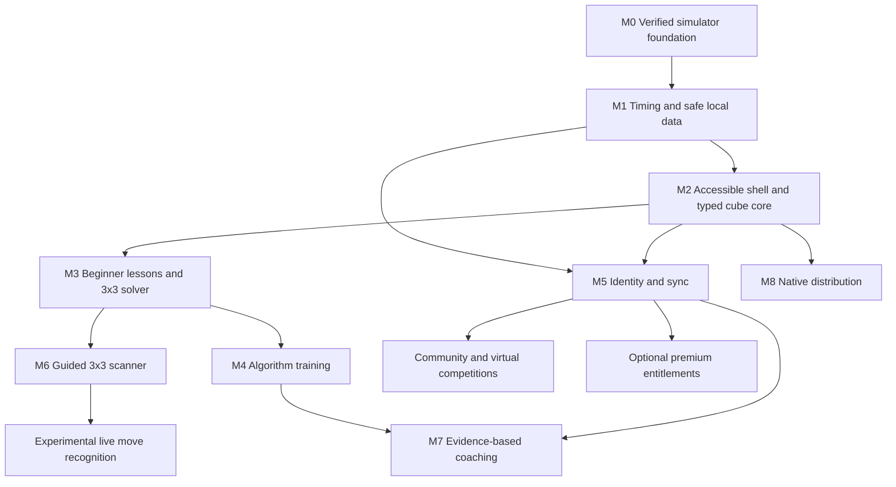

# Delivery, estimates, risks and decision gates

## Dependency plan

The dependency graph allows independent work, but it is not permission to launch every stream simultaneously. The default delivery sequence is M1 → M2 → M3 → M4 → M5 → M6 → M7/M8. Prioritize based on actual use and defects. The estimates below are planning ranges for one experienced engineer with periodic product/content review; they exclude app-store waiting, legal review and externally authored content. Re-estimate after each milestone.

| Milestone | Deliverables | Exit gate | Planning range |
| --- | --- | --- | --- |
| M0 | Keyboard, build/PWA repairs, targeted regression tests and audit | Branch CI passes; retained simulator works | Implemented foundation; CI follow-up included |
| M1 | Strict timing/statistics modules, physical timer, sessions, JSON backup/import, legacy migration | Boundary tests, reload/write-failure recovery, sample history preservation | 2–3 engineer-weeks |
| M2 | React/Vite shell, typed cube-core/renderer adapter, input queue/remapping, accessible settings, locale framework | All cube-size invariants, keyboard/manual accessibility and browser/device matrix | 3–5 weeks |
| M3 | Reviewed beginner lessons, manual state editor, verified 3×3 solver and playback | Invalid-state fixtures, engine license/device benchmark, every solution verified | 3–5 weeks plus lesson review |
| M4 | PLL then OLL/F2L practice, content provenance, attempt tracking, optional collection | Verified setup/algorithms, content QA and progress correctness | 2–4 weeks plus content curation |
| M5 | Identity/profile, optional cloud sync, export/deletion jobs, staging/production backend | Two-user isolation, concurrent sync/restore tests, operator/privacy readiness | 4–6 weeks |
| M6 | Guided 3×3 capture/classification/correction, camera permission lifecycle | Device/lighting benchmark, manual fallback, no unchecked impossible states | 3–6 weeks; recognition research can extend this |
| M7 | Measured training summaries, rule-based suggestions, optional AI/voice | Evidence tests, consent, cost limits, hallucination/fallback evaluation | 2–4 weeks after sufficient telemetry/data |
| M8 | Capacitor/Tauri shells, native adapters, signing/upgrades and platform QA | Real-device installation/offline/permission/recovery checks per OS | 4–8 weeks; stores/signing external |

This is roughly 23–41 engineer-weeks for the main future milestones if done serially, not a promised launch date. Community, advanced solving methods, broader scanners, complete translations and billing are separate estimates. Do not treat the large original vision as one sprint.

## Next sprint: M1 tasks in order

| Task | Dependency | Work and acceptance | Size |
| --- | --- | --- | --- |
| T-101 | M0 green | Add workspace/typecheck setup for timing/statistics only; strict flags; existing build still passes | 1–2 days |
| T-102 | T-101 | Injected-clock state machine; press/release ownership; inspection boundary/focus-loss/auto-repeat tests | 2–3 days |
| T-103 | T-101 | Pure statistics: effective times, DNF, ties, trim count, missing samples, PB recalculation; documented rule versions | 1–2 days |
| T-104 | T-101 | Typed IndexedDB repository; transaction/error/reopen tests; namespace isolation | 1–2 days |
| T-105 | T-104 | Legacy migration and JSON import/export; deterministic IDs, quarantine, readback and rollback fixtures | 2–3 days |
| T-106 | T-102/T-103/T-104 | Physical timer UI, session picker/history, inspection option, penalty review; retain simulator entry | 2–3 days |
| T-107 | T-105/T-106 | Keyboard/touch/offline/reload tests, visual/accessibility review and release notes | 1–2 days |

Time boxes overlap only where dependencies permit. The lower milestone estimate assumes reusable UI/test infrastructure; the task upper bounds indicate where a spike may expand the milestone. Finish correctness/recovery before adding trend charts or polish.

## Follow-on task groups

- **M2:** isolate legacy lifecycle/disposal → canonical cube fixtures and engine → renderer port → queue/input profiles → app shell/deep links → semantic settings/reduced motion → English/Hindi catalog → browser/device regression.
- **M3:** license/benchmark solver candidates → publish state convention → manual face editor/legality validator → worker and cancellation → independent solution verifier → reviewed notation lesson → pedagogical lesson sequence → offline content packs.
- **M4:** algorithm provenance catalog → setup/solution validator → PLL case viewer → recognition/execution attempt model → trainer UI → OLL/F2L sets → collection module if demand supports it.
- **M5:** hosting/identity/budget ADR → real migrations/RLS/runtime role → auth/session controls → owned CRUD → per-owner feed/receipts → snapshot/conflict UX → guest link/account separation → export/deletion jobs → backup/restore/load tests → staged account launch.
- **M6:** camera capture prototype → lighting/color benchmark → orientation guide → classifier/confidence correction → legality integration → camera lifecycle/device QA → research live assistant separately.
- **M7:** measurable evidence definitions → deterministic drill recommendations → reviewed content references → optional model adapter/evaluation → voice/localization → cost and privacy controls.
- **M8:** web/PWA device gaps → native platform spike → storage/auth/camera adapters → build/sign/update pipeline → store review and per-platform rollout.

## GitHub tracking and change workflow

The repository documents are the current roadmap. Suggested GitHub Project fields: Status (Backlog/Ready/In progress/Review/Done/Blocked), Milestone, Module, Priority, Estimate, Dependency and Release gate. Issue titles use the task IDs above; each issue includes acceptance, tests, migration impact and links to the applicable contract.

Project/issue creation is a separate optional administrative step; this plan does not claim that a GitHub Project has been created. The user has authorized pushing repository modifications, so each complete change set is committed and pushed to `codex/phase-one-foundation` while that is the active branch. After merging, use an agreed successor branch and the same policy. See [CONTRIBUTING.md](../../CONTRIBUTING.md).

Definition of done: scoped acceptance met; meaningful checks pass; docs/contracts updated; migration/deployment impacts recorded; focused commit pushed; remote branch SHA confirmed; CI conclusion inspected and failures addressed. Production deployment/app-store publication has its own release gate. Do not mark later roadmap items complete merely because their architecture is documented.

## Risks and mitigation

| Risk | Impact | Mitigation / decision owner |
| --- | --- | --- |
| Scope exceeds one person's capacity | Incomplete features and long delays | Rahul prioritizes one release outcome; use milestones and defer social/native work |
| Legacy geometry is authoritative | Invalid moves/resume regressions | Typed integer core, golden fixtures, renderer adapter and retained legacy loader |
| Lost local history | Loss of user trust | Transactional writes, immutable migration backup, tested import/export and quota UX |
| Browser/device timing differences | Incorrect practice measurements | Interrupted-state policy, monotonic clock tests, real-device suspend checks |
| Scanner accuracy varies by lighting/cube | Unsolvable or wrong state | Guided capture, manual correction, validator and published device benchmark |
| Method-specific solving is oversold | Bad teaching | Separate generic solver from reviewed pedagogical methods |
| Sync reorders or overwrites data | Silent data loss | Owner-serialized feed, version preconditions, immutable snapshots and preserved conflicts |
| Fake community results/abuse | Untrustworthy rankings and moderation burden | Explicit trust labels; gated launch; block/report/staffing requirements |
| Unclear content/code rights | Rebranding/commercial launch risk | Provenance/license inventory and owner review before publication |
| Vendor cost/lock-in | Unplanned operating cost | Adapters, budget caps, open export formats and provider ADR at adoption |
| Old clients/workers survive deployment | Mixed assets or failed migrations | Content-hashed artifacts, compatible migrations and legacy-worker staging tests |

## Decisions still required before their milestones

These do not block M1: final product name/branding; public domain; target regions and audience/age policy; primary mobile reference devices; monthly hosting/AI budget; identity/hosting provider; reviewed algorithm/lesson sources; public moderation capacity; launch languages beyond English/Hindi; premium feature proposition. Record decisions as dated ADR amendments with the evidence and tradeoff, not silent changes to the architecture.

## Reference review

Primary sources were checked on 10 September 2026 and are linked next to the decisions they support. WCA rule version observed: 1 April 2026. Recheck official rules before implementing/updating the practice rule profile. Stack versions, service prices, platform/store policies and provider capabilities must be revalidated at their implementation milestone. Architectural targets and cost/effort assumptions belong to this project and are not claims from those sources.
