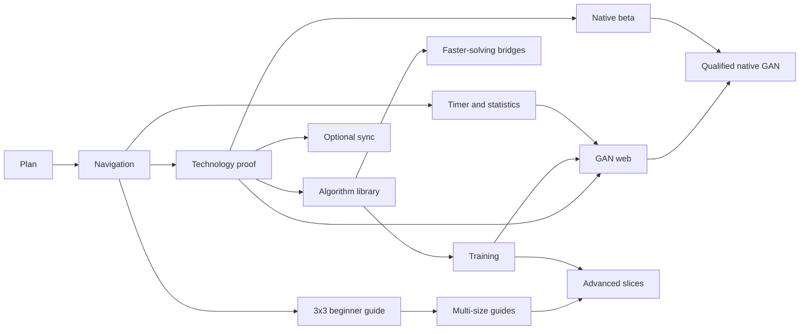

# Delivery plan v2

16 September 2026. This plan replaces the old M5–M8 execution order with smaller phases covering navigation, libraries, GAN and cross-platform delivery. M0–M4 retain their historical meaning and working features. **P0–P10** are the revised plan, not completed releases.

See [architecture v2](17-platform-architecture.md), [dependency review](18-reference-review.md) and [copy-paste prompts](08-build-guide.md).

## Phases and acceptance

| Phase | User-visible outcome | Work and dependencies | Exit gate |
| --- | --- | --- | --- |
| P0 — Architecture revision | Clear destination and build commands | Repository/reference analysis, stack decisions, preservation inventory | Reviewed documentation and working links/contracts; no runtime changes |
| P1 — Clear application sections | Algorithms, Training, Guides, Solve, Practice, Timer, Statistics, Settings | Existing React shell; landing pages connect current features and retain original home/panels | Every destination has a real action; old bookmarks, direct panels, back navigation, data and offline checks pass |
| P2 — Technology and platform proof | A measured foundation for later work | After P1; SvelteKit static prototype, cubing.js adapters, styling/icon candidates and BLE/native feasibility | Recorded keep/migrate decision, license checks, comparable measurements and data/worker/offline proof; missing hardware evidence labeled |
| P3 — Algorithm library | Find, understand, favorite and choose case variants | P1/P2; versioned catalog, existing PLL/OLL and expanded F2L with declared taxonomy | Independent fixtures prove cases and stage outcomes; preserved progress IDs; search/filter/variant/favorite and provenance checks |
| P4 — Complete beginner guides | Complete 3×3, 2×2, 4×4 and 5×5 courses, then a route into CFOP | Separate P4A–P4E releases under the tutorial specification; P4A can use existing modules before P2/P3; advanced bridges reuse catalog work | Intended lesson inputs, case/stage coverage, wrong-state help, saved resume, offline, accessibility and content review pass |
| P5 — Training and review | Recognition, guided execution, weak-case practice and spaced review | P3; expand PLL/OLL/F2L drills, optional timing and mixed sets | Scoring, randomness/coverage, answer hiding, interruptions, scheduling and saved history verified |
| P6 — Timer and statistics | Focused timing plus trends and competitor practice | P1; preserve engine, add chart/table views, filters, source separation and versioned rule profiles | Statistics/DNF fixtures, input/focus, edits, large-history performance, backup and original statistics checks |
| P7 — GAN browser support | Practice with real turns from a supported smart cube | P2 device port plus P5/P6 flows; browser adapter, state/timestamp checks and reconnection | Named hardware/firmware and browser/OS tested; stream-gap/duplicate/disconnect recovery; manual fallback |
| P8 — Optional accounts and sync | Carry private history/progress across devices | P2 boundaries; Supabase region/cost/auth decisions; sessions/solves first, then learning/training | Two-user isolation, concurrent/retried sync, guest linking, conflicts, sign-out, export/deletion and restore |
| P9 — Mobile and desktop beta | Installable apps with honest capability lists | P2 platform proof, P7 for GAN claims; Capacitor mobile and Tauri desktop; guest beta independent of P8 | Real-device install/update/offline/migration/recovery; native capabilities where claimed; signing/store gates separate |
| P10 — Advanced capabilities | Camera capture, evidence-based coaching and selected advanced tools | Separate slices: scanner needs solver/device proof; coaching needs reliable evidence; new puzzles need domain support | Each slice has correctness, rights, privacy, cost and device gates; no blanket advanced-feature completion |

P0 is complete. P1 implements the eight application sections on React; see [its release and testing notes](19-p1-release.md). P2 is next when authorized. It retains the working framework unless comparison justifies migration; it does not automatically replace the live UI. Finish and qualify any selected migration before P3 expands the affected UI.

Split phases into coherent releases. P3 ships the catalog and existing sets first, then verified F2L batches. P4 ships reviewed lesson stages. P5 ships one drill family at a time. P8 splits by data domain, P9 by platform. A phase prompt does not imply one huge commit.

The [tutorial experience specification](20-tutorial-experience.md) defines P4A–P4E
and the requested reference layout. The owner can prioritize P4A on React before
P2; this does not authorize a framework migration or claim completed courses.

## Dependencies and order

Default sequence: P1 → P2 → P3 → P4 → P5 → P6 → P7 → P8 → P9 → selected P10 slices. Dependencies allow reprioritization: the 3×3 beginner course can follow P1 on React, timer/statistics can precede expanded guides, and native guest testing can precede accounts. This is not permission for simultaneous implementation streams.

Estimate the next bounded release after inspecting its code and tests. Do not carry forward the old total-week estimate: framework selection, authored content, source rights, hardware and native toolchains materially change scope. No completion date, usage-quota guarantee or service budget is implied.

## Earlier milestones and original vision

| Earlier work | Current treatment |
| --- | --- |
| M0 foundation | Retain tested build, offline and repository workflow |
| M1 timer/data | Retain; P6 improves presentation/analysis, P8 adds optional sync |
| M2 shell/engine | Retain original home and typed domain; P1 organizes, P2 evaluates upgrades |
| M3 lessons/solver | Retain; P4 expands teaching, P10 may add camera input |
| M4 PLL/recognition/OLL/F2L | Retain shipped sets/progress; P3/P5 extend learning tools |
| M5 accounts/sync | P8; Supabase replaces the default custom-backend proposal |
| M6 scanner | P10 scanner slice after solver/input/device proof |
| M7 coaching | P10 evidence-first slice, optional provider after cost/privacy review |
| M8 native | P2 early feasibility, P9 platform releases |

The original six-phase destination remains covered: foundation/UI/PWA (M0–M2, P1/P2), accounts/profiles/sync (P8), solver/scanner (M3, P10), tutorials/algorithms (P3–P5), coaching (P10), and mobile/desktop/offline (P2/P9). Community, official-profile integration, leaderboards, collections, wider puzzles, additional languages and monetization remain separately scoped future slices. Public community features require moderation capacity. None is silently included in the first native beta.

## Risks and release rules

| Risk | Required response |
| --- | --- |
| Framework work repeats solved problems | Measure prototype and migration cost; retain React without demonstrated benefit |
| Lost data or changed route scope | Namespace inventory, exact backups, idempotent migrations and recovery fixtures |
| Styling erases original theme | Baseline visuals, scoped CSS, original panels and responsive review |
| Incorrect/mislabeled case | Independent fixtures, stage predicates, orientation/AUF checks and provenance |
| Unclear reuse rights | Review exact artifacts; author/link content when reuse is unresolved |
| BLE works on only one device | Capability detection and named hardware matrix; manual fallback |
| Sync overwrites attempts | Transactional outbox, receipts, version checks, preserved conflicts and restore tests |
| Endless scope growth | One bounded outcome per release; update status and next command |

Application releases require relevant unit/type/build/browser checks, built-in browser inspection, data/offline upgrade checks, a focused commit, ordinary push to main, matching remote SHA/CI/Pages verification and owner test steps. Documentation-only releases require architecture/link checks and diff review, followed by the same repository publication policy. Preserve master, keep only the authorized branches and use neutral names under [CONTRIBUTING.md](../../CONTRIBUTING.md).

Owner input is needed when actual GAN hardware, physical devices, production budget/region or signing/store credentials become prerequisites. Continue independent preparation meanwhile. Do not purchase services, invent device verification or claim store publication without evidence.
