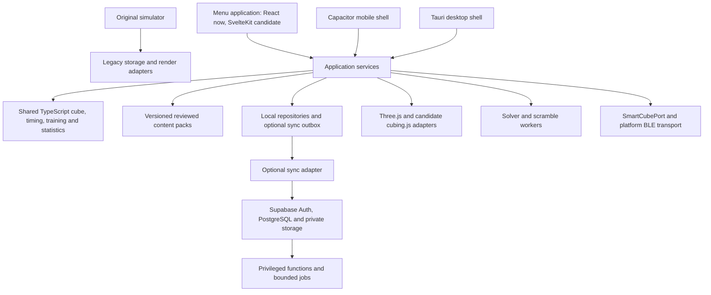

# Platform architecture v2

16 September 2026 · Owner: Rahul Singh Parmar · Status: planning baseline, not an implementation release

This revision incorporates the requested reference sites, separate application sections, smart cubes and cross-platform delivery. It supersedes the v1 future stack, navigation and milestone ordering where they differ. Existing release notes remain the record of delivered features. Read the [reference and dependency review](18-reference-review.md) and [phase prompts](08-build-guide.md) alongside this document.

## Direction and upgrade assessment

Evolve the existing application in small releases. Keep the original simulator at `https://rahulsinghparmar.github.io/the-cube/`, including its familiar settings, statistics, typography, colors and cube appearance. Build a coherent tools application behind Menu. Borrow the references' clear organization and teaching patterns; create our own interface and reviewed content.

The current React/Vite shell, strict TypeScript domain packages and local persistence are a useful foundation. Replacing all of them would repeat solved work and increase data and playback risks. Recommendation: retain React for the first navigation release, then measure a SvelteKit prototype before choosing a migration. SvelteKit remains a supported target option, not an already approved production cutover. Cross-platform delivery does not depend on that choice.

| Area | Verified repository baseline | Upgrade boundary |
| --- | --- | --- |
| Home | Original full-screen simulator and original settings/statistics panels | Preserve identity and saved game; make direct panel navigation reliable |
| Tools | React/Vite menu and practice cube | Clear sections, shared navigation, search and reusable page patterns |
| Timing | Physical timer, inspection, penalties, sessions, statistics, import/export | Dedicated statistics destination, charts and practice analysis |
| Learning/solving | Eight prepared lessons, manual 3×3 entry, checked local solver, playback | Complete beginner journey and broader reviewed instruction |
| Training | 21 PLL, PLL recognition, 57 OLL, 12 beginner F2L setups | Searchable library, expanded F2L taxonomy, OLL/F2L recognition and review scheduling |
| Data | Guest IndexedDB plus versioned local-storage records | Repository adapters and eventual optional account sync |
| Delivery | Static Pages build, offline worker and browser CI | Capability tests, physical-device qualification and native packages |
| Not built | Accounts, GAN connectivity, camera scanner, native product releases | Separate phases with explicit acceptance and operating dependencies |

The 12 beginner F2L setups are not the complete standard 41-case collection. Prepared lessons are not an adaptive beginner-method solver. Existing Android packaging files do not establish a tested, current native release.

## Application sections and routes

The home cube is always one action away. Desktop/tablet navigation shows grouped destinations; phones use a compact menu with a few frequent shortcuts, not eight crowded bottom tabs. Keep keyboard reference hidden until requested. Show one clear primary action per screen, with optional advanced controls disclosed progressively.

| Section | Purpose | Initial route / compatibility |
| --- | --- | --- |
| Home | Original touch simulator | `/the-cube/` remains unchanged |
| Menu | Choose a tool or resume learning | `menu.html#/menu` |
| Algorithms | Browse cases, patterns, variants, notation, favorites and source notes | New `menu.html#/algorithms`; selecting a case can open its existing trainer |
| Training | Recognition, guided execution, timed drills and later spaced review | New `menu.html#/training`; keep `#/train`, `#/recognize`, `#/oll`, `#/f2l` working |
| Guides | Beginner curriculum, notation, glossary, method pathways | New `menu.html#/guides`; retain `#/learn` and its saved lesson IDs |
| Solve | Manual state, validation and checked solution; camera later | Keep `menu.html#/solve` |
| Practice | Free virtual-cube practice with its own saved checkpoint | Keep `menu.html#/play`, visibly labeled Practice |
| Timer | Physical-cube attempts, inspection and session selection | Keep `timer.html`; do not change its persistence namespace with a route move |
| Statistics | Choose physical solves, original simulator or training history | New `menu.html#/statistics`; original view still `?panel=stats` |
| Settings | App preferences, controls, data, accessibility; devices/account later | Keep `menu.html#/settings`; original cube settings still `?panel=settings` |
| About and licenses | Developer, application information and actual third-party notices | Keep `#/about` and `#/license` |

The `#/...` entries above are hashes on `menu.html`, not new server routes. New sections are planned. P1 creates landing pages using current features; later phases add their deeper capabilities. Links to original settings/statistics must open the panel directly without an introductory cube animation. Back/close returns to a meaningful previous destination. Never silently replace an old bookmark with a reset or empty screen.

Use the established theme as the token source. Preserve the original heading identity and readable body text. Reuse existing surfaces, spacing and colors before introducing new ones. Scoped styles must not leak into the original document or timer. Validate focus, contrast, safe areas, 320 px reflow, large text, landscape layouts and touch targets. Motion should explain turns and transitions; it must be interruptible and respect reduced motion. Decorative 3D must not slow the timer or compete with the instructional cube.

## Learning pathways

The [tutorial experience specification](20-tutorial-experience.md) adds the
owner-requested reference layout, synchronized instructional playback and complete
2×2–5×5 course releases. It is the detailed learning requirement after P1; current
prepared exercises remain available until those courses are independently released.

| Audience | Path | Evidence of progress |
| --- | --- | --- |
| First-time learner | Hold the cube → notation → cross → corners → middle layer → last layer | Short checks, saved lesson position, explanation of mistakes and next action |
| Developing solver | Intuitive F2L → two-look last layer → full PLL → full OLL | Recognition accuracy and guided repetitions, separate from simply watching playback |
| Advanced solver | Full F2L coverage, cross planning, lookahead, algorithm variants, weak-case review | Repeatable drills, explicit sample counts, trends and recall intervals |
| Competitor | Event/session preparation, inspection practice, consistency and optional move analysis | Versioned rule profile, source-labeled results and reliable measurements |

Every lesson specifies prerequisites, orientation, goal, what to look for, a short explanation, controllable 3D example, learner action, success check and recovery help. Let users replay, go back, change speed or use a text/diagram alternative. A guided example must say when its starting state is prepared. Offer manual state entry for a real cube that does not match the example. Do not describe the current generic solver's moves as a beginner or CFOP explanation.

Professional usefulness comes from correctness, precision and focused practice. It does not imply official competition certification or copying elite-solve statistics without a licensed source. New events/methods are separate content packs with their own engines, rules and tests.

## System boundaries

This is a target boundary diagram, not a list of installed services. Dependency direction is UI/platform adapters → application services → pure domain. Domain modules must not import React, Svelte, Three, browser storage, Supabase or Bluetooth globals.

Keep the existing `packages/cube-core`, `practice`, `solver` and `academy` packages. Extract `content`, `storage`, `devices`, `platform` and shared UI components only when a real consumer justifies each boundary. Keep timing/statistics in `practice` until extraction has a concrete benefit. A future `supabase/` directory holds reviewed migrations, authorization tests and functions; `apps/mobile` and `apps/desktop` hold platform projects when introduced. Avoid creating empty packages or simultaneous duplicate services.

### Cube, diagrams and rendering

The exact logical state remains authoritative. Define and test conversions between the existing URFDLB convention, cubing.js patterns, diagram inputs and GAN facelets. Pin orientation, face colors, rotations, slices, wide moves and AUF handling in fixtures. Never migrate the original geometric save by approximation.

Use Three.js for the established interactive cube. Evaluate cubing.js for notation, puzzle definitions, scramble generation and training playback behind ports. Keep the independently checked solver. Measure download size, worker startup and duplicate Three versions before adoption. One mounted player owns one render lifecycle; stop rendering when hidden, dispose resources and cancel stale worker requests. A library introduction must not downgrade the original cube's edges, lighting or resolution.

Catalog grids use precomputed SVG/thumbnail diagrams, not dozens of running WebGL canvases. Investigate sr-visualizer only after resolving its package/source license discrepancy. Existing diagram generation is the fallback. Lazy-load 3D for the selected case. Use device-appropriate pixel density, context-loss recovery and a readable fallback when WebGL is unavailable.

### Content and verification

Each case needs a stable ID, content revision, puzzle/method/stage, named taxonomy, orientation, independent canonical fixture, recognition cues, target predicate, algorithm variants, setup, provenance and review status. Variants include notation, author/source when known, move-count convention, handedness/fingertrick notes and applicable pre/post AUF. Stable IDs preserve progress when wording or a preferred algorithm changes.

Verification must check legality, the declared case pattern and the intended stage outcome. PLL must preserve F2L and solve up to declared AUF; OLL must preserve F2L and orient the last layer, without requiring permutation; F2L must preserve the cross and protected slots while inserting the specified pair. Testing an algorithm only against its own inverse is insufficient evidence that it represents the named case. Use independently reviewed fixtures and cross-engine checks where possible. Publish the equivalence rules behind case counts; do not assume different sites' F2L numbering is interchangeable.

Lesson packs include prerequisites, localized reviewed copy, examples, checks and versioned assets. Link to external videos with source/timestamps where permitted; do not download or rehost them by default. Record changes and retain enough revision metadata to interpret historical attempts.

### Local data, migration and backups

Local repositories remain the source of truth for offline attempts; charts and query caches are derived views. Add saved favorites, case preferences, drill attempts and review scheduling through versioned schemas. An attempt records its content revision, mode, case/variant, input source, timestamps, accuracy/outcome and interruption state. Watching a demonstration is not a successfully executed repetition.

P1 changes navigation without moving stores. The preservation inventory includes:

| Existing data | Identifier family | Required upgrade check |
| --- | --- | --- |
| Original simulator/settings/scores | `theCube_*` | Exact retained save and preferences; original resume and panels |
| Modern cube and preferences | `the-cube-v2:` / `the-cube-preferences-v2:` plus scope | Same state and settings after navigation/reload |
| Physical sessions/solves | IndexedDB `the-cube-practice:` namespace; pending journals | Same IDs, order, penalties, backup and pending-write recovery |
| Lessons and solver input | `the-cube-lessons-v1:` / `the-cube-solver-input-v1:` | Same lesson progress and editable input |
| Training | `the-cube-pll-v1:`, `the-cube-pll-recognition-v1:`, `the-cube-oll-v1:`, `the-cube-f2l-v1:` | Same counts/history and case IDs |

Scope is part of identity: existing modern/learning stores use the `/the-cube/` scope; inspect the actual timer namespace and journal paths before any relocation. Do not derive replacement namespaces from new routes. Retain old keys through a migration compatibility window. Back up raw bytes first, validate imported content, make migrations idempotent, commit atomically and read back before using the new store. Quarantine malformed records with export/recovery rather than clearing everything. Never call a blanket storage clear during upgrade.

Provide an eventual unified backup manifest that includes every subsystem and version, while continuing to accept current subsystem exports. Native applications have separate origins/stores: browser data does not automatically appear in them. Offer explicit export/import or optional account sync, with a preview and deduplication. Test quota errors, interrupted migrations, concurrent tabs, old service workers and rollback. [Existing detailed data invariants](03-data.md) continue to apply.

### Optional cloud and accounts

Supabase is the recommended first cloud candidate: Auth, PostgreSQL, optional private Storage and narrowly scoped functions. It replaces the previous default proposal to provision Fastify plus separate managed identity/object-storage services. Do not run both stacks without a demonstrated requirement. Hosted costs, region, email delivery, retention, backups and deletion must be settled before provisioning production.

Retain the existing sync semantics: local transaction plus outbox, idempotent mutation receipts, owner-scoped ordering, version checks, explicit conflicts, tombstones and consistent bootstrap snapshots. Realtime notifications can prompt a pull; they are not a durable sync log. TanStack Query manages remote request/cache state, not durable solve history. Start with sessions/solves, then add learning/training sync through a separately tested schema extension.

Expose only required grants and owner-bound RLS policies; test two-user reads, writes, RPCs and export/deletion. Publishable client keys are distinct from secret/service-role credentials, which must stay server-side. Use audited transactional RPCs/functions for sync operations whose checks and writes must be atomic. [Supabase RLS](https://supabase.com/docs/guides/database/postgres/row-level-security).

GitHub Pages cannot host a same-origin login server. Proposed initial static-client auth uses Supabase PKCE with a memory-only session (`persistSession: false`): reauthentication after reload is acceptable for the first account release; offline local practice continues. Native refresh tokens belong in OS secure storage. Persistent web login would require a separately reviewed storage/security decision or hosted backend-for-frontend. Do not accidentally enable persistent browser tokens through SDK defaults. Rewrite the transport/auth portions of the existing OpenAPI draft before account implementation; its current cookie API is an earlier proposal, not a Supabase contract. [Supabase session model](https://supabase.com/docs/guides/auth/sessions).

### GAN smart cubes and timers

Introduce a `SmartCubePort` with connect/disconnect, capabilities, facelet snapshots, sequenced move events, battery where available, state resynchronization and errors. The browser implementation can use gan-web-bluetooth for supported GAN protocols; select a named cube model and firmware for the first hardware acceptance test. Support claims must name the tested matrix, not all GAN products. [Library and supported devices](https://github.com/afedotov/gan-web-bluetooth).

Require an intentional Connect action, secure context and clear permission feedback. Detect unsupported browsers before opening a chooser. Web Bluetooth is not universally available, including ordinary Firefox/Safari use; Windows/macOS Chromium and Android Chrome are initial web candidates. Native iOS/Android need a BLE transport adapter; installing a web wrapper alone does not provide that bridge. Evaluate the Capacitor BLE plugin and GAN protocol adaptation in P2, qualify them in P9. Desktop webviews need separate investigation. [Browser implementation status](https://github.com/WebBluetoothCG/web-bluetooth/blob/main/implementation-status.md), [Capacitor BLE](https://github.com/capacitor-community/bluetooth-le).

Store host and device timestamps plus sequence and calibration metadata. Detect duplicates, gaps, clock wrap and disconnects; compare reconstructed state with a fresh snapshot. Mark incomplete streams unreliable instead of inventing missing moves or recording a successful drill. Distinguish timer-device results from move-derived duration. Keep raw measurements so a later calibration fix does not destroy evidence. Identifiers/MAC addresses stay local unless explicitly required and consented to; do not put them in analytics or share cards. Hardware tests cover denial, reconnect, sleep, missed events, rapid turns and resync. Mocked tests cannot qualify real Bluetooth support.

### Cross-platform and offline delivery

| Target | Delivery | Qualification boundary |
| --- | --- | --- |
| Desktop/mobile web | Existing Pages URL and offline app | Chrome/Edge, Firefox, Safari; phone/tablet/desktop input and saved-data checks |
| Android/iOS | Capacitor candidate using the selected web UI | Native BLE, camera, secure credentials, lifecycle, file export, signing and store review |
| Windows/macOS/Linux | Tauri candidate | OS-specific rendering/input, file access, storage, signing/update path and BLE support |

Share domain/content and application flows. Isolate platform storage, BLE, camera, haptics, share/export and lifecycle behind explicit capabilities. PWA installation improves access but does not grant missing native APIs. Native guest use must work without cloud accounts; P9's guest beta can proceed without P8 cloud completion. iOS signing/build tooling and physical devices require separate access; account/store fees are not covered by an open-source library license.

Retain `/the-cube/` and current HTML/hash URLs. If SvelteKit wins P2, use a static build with the base path, generated public routes and compatibility handling for old HTML/hash URLs. Keep one service-worker owner for the scope; test old-to-new updates and complete offline packs. No SvelteKit server actions or secret backend execution can run on Pages. Public guide/catalog share pages may be prerendered; private history is never embedded in public build output. [SvelteKit static hosting](https://svelte.dev/docs/kit/adapter-static).

## Quality and release gates

P1 records current route bundle sizes, cold/warm startup, cube frame time and storage behavior on named devices. Proposed acceptance targets: no unexpected layout shift during controls/playback; no horizontal overflow at 320 px; 44 px primary touch targets; responsive input without long main-thread work; 60 fps on the reference midrange device where practical, with measured quality fallback. Record actual numbers and conditions; these are not achieved benchmark claims.

Every visible release needs unit/contract tests appropriate to its logic, build/type checks, Chromium/Firefox/WebKit regression, built-in browser review and old-data/offline checks. Real iPhone/iPad/Android and desktop hardware checks gate native/BLE support. Automated accessibility checks are supplemented with keyboard, reduced-motion and screen-reader review. Timers use monotonic measurement independent of render rate. Charts use bounded/aggregated data and a table alternative.

Push each coherent verified change to `main`; preserve `master` and neutral repository naming. Inspect the matching CI and Pages deployment, then verify real routes and retained data on the live URL. Roll back application assets only when schema compatibility is known; preserve backups and prefer a forward repair after a storage migration. Keep draft schemas, prototype frameworks and unqualified hardware features clearly separate from shipped capabilities.

## Decision register

| Decision | Recommendation / gate |
| --- | --- |
| Framework | React remains production for P1. P2 compares a small SvelteKit static prototype; migrate only with evidence and a recorded selection |
| Visual identity | Original simulator and panels remain the reference; new sections adapt to it |
| 3D | Keep Three; evaluate cubing.js incrementally without replacing saved-state truth |
| sr-visualizer | Hold adoption until package/source licensing is resolved |
| Backend | Supabase candidate supersedes default Fastify proposal; no service provisioned in planning |
| Local history | Offline repositories remain authoritative; framework/provider changes cannot reset progress |
| Native | Capacitor mobile and Tauri desktop candidates; BLE and lifecycle proven per platform |
| Scope | Core 3×3 journey first, advanced events/content and coaching in later independent releases |

The [delivery plan](07-delivery.md) defines dependencies and acceptance. The [build guide](08-build-guide.md) contains the overall prompt and one command per phase. P0 documents this design; it does not mark later features complete.
