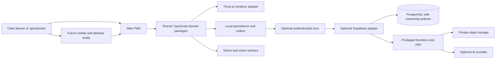

# The Cube architecture plan

Version 2.1 · 17 September 2026 · Owner: Rahul Singh Parmar

The [whole-product coverage plan](21-product-coverage.md) and
[tracked inventory](reference-coverage.json) now expand the scope beyond 3×3
tutorials: all observed multi-puzzle catalogs, trainers, analysis, account and
device features have named releases. P1A adds search, P2A adds shared playback,
and [P2B records the measured decision to retain React](24-stack-evaluation.md).
P3A catalog consolidation is next. Planned entries are not working app features.

Start with [platform architecture v2](17-platform-architecture.md) for the current upgrade plan, [reference and dependency review](18-reference-review.md) for the requested tools and inspiration, and [copy-paste phase prompts](08-build-guide.md) for what to do next. This revision preserves completed work and replaces the earlier future stack/navigation/order where they differ. Planned capabilities are not implemented merely because they appear here.

## Recommended direction

Build an offline-capable cube practice and learning application with shared TypeScript domain modules. Keep the original simulator and its theme at the homepage. Organize the tools into Algorithms, Training, Guides, Solve, Practice, Timer, Statistics and Settings. Retain React for P1, evaluate SvelteKit and cubing.js through P2, and introduce optional Supabase sync and platform-specific GAN adapters in later phases. Capacitor mobile and Tauri desktop remain candidates requiring real-device qualification.

M1 implements the web practice timer, statistics and safe local data. M2 adds the React/Vite interface, typed cube core, queued controls, settings and language foundations. See [the M1 release notes](09-m1-release.md) and [M2 release notes](10-m2-release.md) for tests, recovery and limits. M3 adds [beginner exercises, manual input and verified 3×3 solving](12-m3-release.md). M4 has begun with [the PLL trainer](13-m4-pll-release.md); [recognition drills](14-m4-recognition-release.md) are also implemented, and [all 57 OLL cases](15-m4-oll-release.md) are available; [12 beginner F2L setups](16-m4-f2l-release.md) now add guided pairing and insertion. The server and later features below remain architecture proposals.

The owner-requested [homepage refinement](11-home-and-menu.md) puts the original
touch cube back at the main URL and moves the newer interface and tools into a
separate menu. This is an M2 refinement before M3, not a new milestone.

## Read the plan

Start with [the plain-language build guide and copy-paste commands](08-build-guide.md) to see what is complete, what changes next, and how the milestones map to the original six phases.

| Document | Decisions and deliverables |
| --- | --- |
| [Stack evaluation](24-stack-evaluation.md) | P2B measured comparisons, keep-React decision, licensing and Bluetooth feasibility |
| [Shared playback release](23-playback-release.md) | P2A capabilities, notation, reversible player, preservation and test steps |
| [Platform architecture v2](17-platform-architecture.md) | Current sections, stack decisions, preserved data, content validation, GAN, cloud and cross-platform design |
| [Reference and dependency review](18-reference-review.md) | All requested reference sites and tools, adoption phases, source rights and license discrepancies |
| [Tutorial experience and multi-size courses](20-tutorial-experience.md) | Reference-led lesson layout, playback contract, 3×3/2×2/4×4/5×5 releases and implementation assessment |
| [Product requirements](01-product.md) | Personas, feature scope, user journeys, success criteria and non-goals |
| [System architecture](02-system.md) | Stack, package boundaries, cube representation, timer state machine, solver/scanner design and decision records |
| [Data and synchronization](03-data.md) | Local stores, entities, migration, ownership, conflict resolution and backup format |
| [PostgreSQL reference schema](schema.sql) | Proposed core account/session/solve/sync tables and constraints; not an applied migration |
| [API contracts](04-api.md) | HTTP conventions, worker protocol, staged endpoint registry and authentication model |
| [OpenAPI draft](openapi.json) | Machine-readable account/session/solve/sync API contract; no server is implemented |
| [UX and component system](05-experience.md) | Navigation, design tokens, reusable components, accessibility, localization and offline states |
| [Security, quality and operations](06-operations.md) | Threat controls, tests, performance targets, environments, release, backup and recovery |
| [Delivery and decision plan](07-delivery.md) | P0–P10 phases, dependencies, acceptance gates and mapping from earlier milestones |
| [M1 implementation and release](09-m1-release.md) | Physical timer, local sessions, backup/recovery, verification and user testing |
| [M2 implementation and release](10-m2-release.md) | Modern interface, exact cube state, compatibility decisions, browser checks and user testing |
| [Homepage and menu refinement](11-home-and-menu.md) | Original touch homepage, menu routes, preservation and current testing steps |
| [M3 learning and solving](12-m3-release.md) | Lesson scope, manual entry, engine provenance, verification, backups and owner tests |
| [M4 PLL trainer](13-m4-pll-release.md) | Verified case catalog, guided repetitions, progress recovery and testing |
| [M4 recognition drills](14-m4-recognition-release.md) | Randomized PLL identification, optional timing, history and recovery |
| [M4 OLL training](15-m4-oll-release.md) | Full orientation catalog, verified playback, separate progress and owner tests |
| [M4 beginner F2L](16-m4-f2l-release.md) | Verified pairing setups, phase explanations, guided progress and recovery |
| [Repository workflow](../../CONTRIBUTING.md) | Commit and push policy, branch handling and verification |

The [initial audit](../AUDIT-AND-ROADMAP.md) records the starting implementation and concrete defects already repaired. This architecture plan supersedes that document's short future roadmap where detail differs.

## Current versus planned

[P1 application sections](19-p1-release.md) are implemented on React. Algorithms,
Training, Guides and Statistics organize the existing tools alongside Solve,
Practice, Timer and Settings. Original home/panels and old routes remain available.
P2A playback and P2B evaluation are complete. P3A is next; no framework migration has shipped.

| Area | Current foundation | Target |
| --- | --- | --- |
| Simulator | Strict typed 2×2–5×5 core, renderer adapter, queued keyboard/button moves; retained original simulator | Solver playback and further device verification |
| Timing | Retained virtual timer plus dedicated physical timer, inspection, penalties, sessions and trimmed averages | Unified shell and broader device verification |
| Persistence | Legacy keys and bounded new cube checkpoints plus transactional guest IndexedDB, migration and backup/import | Optional cloud sync and authenticated namespace adapters |
| Delivery | React/Vite shell, retained Rollup entries, three-engine browser CI and automated accessibility checks | Physical-device matrix, full accessibility and recovery gates |
| Solving/learning | Eight prepared beginner lessons, legal manual 3×3 entry, independently verified local solver and playback | Broader lesson coverage, real-device qualification and further algorithm training |
| Accounts/scanner/AI/native | Not implemented | Gated milestones with explicit device, privacy, cost and correctness tests |

## Architecture invariants

1. A learner can practice without an account or a network connection after required content is downloaded.
2. Logical cube state is authoritative. Animations visualize commands; they do not determine whether a cube is solved.
3. Every solver result is checked by applying it to the submitted state. AI explanations cannot override this check.
4. A completed attempt is saved locally before the next attempt is ready. Failed writes remain visible and recoverable.
5. Simulator, physical, imported and competition results retain their source and are never silently mixed.
6. Device timestamps never decide synchronization conflicts or official rankings.
7. User data survives upgrades through versioned migrations and exportable backups.
8. Successful main-branch checks automatically publish the web build; confirm the matching deployment and rendered routes. Native store publication remains a separate gate.

## Validation status

The baseline work passed 13 unit tests and three local Chromium scenarios. The first remote CI run exposed non-unique Euler-angle comparisons in a test; the follow-up uses transform matrices. GitHub Actions is the authority for the current branch's remote status.

Architecture checks validate Markdown file links, OpenAPI references and contract structure. The SQL is a design reference until it has run against the selected PostgreSQL version with authorization, transaction and migration tests. Performance, accessibility, availability and capacity numbers in this plan are proposed acceptance targets, not achieved measurements.

The OpenAPI draft was also checked with Redocly CLI 2.51.2. Its license-metadata warning is deliberately unresolved pending the repository provenance/licensing review; schema validation does not grant content rights or establish runtime correctness.
