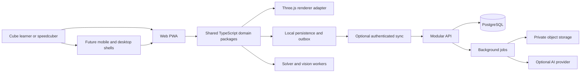

# The Cube / CubeMaster AI architecture plan

Version 1.0 · 10 September 2026 · Owner: Rahul Singh Parmar

This is the target product and engineering plan for evolving the existing repository. The first foundation release is implemented; the capabilities described below are planned unless explicitly marked otherwise. CubeMaster AI is a working product name, pending a branding and provenance decision.

## Recommended direction

Build an offline-capable cube practice and learning application with a shared, deterministic TypeScript domain model. Preserve the current simulator while adding a physical-cube timer, then learning and solving. Add an authenticated modular backend for synchronization and community features when those features enter development. Use the web application as the basis of future mobile and desktop clients.

M1 implements the web practice timer, statistics and safe local data. M2 adds the React/Vite interface, typed cube core, queued controls, settings and language foundations. See [the M1 release notes](09-m1-release.md) and [M2 release notes](10-m2-release.md) for tests, recovery and limits. The next implementation milestone is **M3: learning and solving**. The server and later features below remain architecture proposals.

The owner-requested [homepage refinement](11-home-and-menu.md) puts the original
touch cube back at the main URL and moves the newer interface and tools into a
separate menu. This is an M2 refinement before M3, not a new milestone.

## Read the plan

Start with [the plain-language build guide and copy-paste commands](08-build-guide.md) to see what is complete, what changes next, and how the milestones map to the original six phases.

| Document | Decisions and deliverables |
| --- | --- |
| [Product requirements](01-product.md) | Personas, feature scope, user journeys, success criteria and non-goals |
| [System architecture](02-system.md) | Stack, package boundaries, cube representation, timer state machine, solver/scanner design and decision records |
| [Data and synchronization](03-data.md) | Local stores, entities, migration, ownership, conflict resolution and backup format |
| [PostgreSQL reference schema](schema.sql) | Proposed core account/session/solve/sync tables and constraints; not an applied migration |
| [API contracts](04-api.md) | HTTP conventions, worker protocol, staged endpoint registry and authentication model |
| [OpenAPI draft](openapi.json) | Machine-readable account/session/solve/sync API contract; no server is implemented |
| [UX and component system](05-experience.md) | Navigation, design tokens, reusable components, accessibility, localization and offline states |
| [Security, quality and operations](06-operations.md) | Threat controls, tests, performance targets, environments, release, backup and recovery |
| [Delivery and decision plan](07-delivery.md) | Dependency graph, milestones, sprint tasks, estimates, risks and outstanding decisions |
| [M1 implementation and release](09-m1-release.md) | Physical timer, local sessions, backup/recovery, verification and user testing |
| [M2 implementation and release](10-m2-release.md) | Modern interface, exact cube state, compatibility decisions, browser checks and user testing |
| [Homepage and menu refinement](11-home-and-menu.md) | Original touch homepage, menu routes, preservation and current testing steps |
| [Repository workflow](../../CONTRIBUTING.md) | Commit and push policy, branch handling and verification |

The [initial audit](../AUDIT-AND-ROADMAP.md) records the starting implementation and concrete defects already repaired. This architecture plan supersedes that document's short future roadmap where detail differs.

## Current versus planned

| Area | Current foundation | Target |
| --- | --- | --- |
| Simulator | Strict typed 2×2–5×5 core, renderer adapter, queued keyboard/button moves; retained original simulator | Solver playback and further device verification |
| Timing | Retained virtual timer plus dedicated physical timer, inspection, penalties, sessions and trimmed averages | Unified shell and broader device verification |
| Persistence | Legacy keys and bounded new cube checkpoints plus transactional guest IndexedDB, migration and backup/import | Optional cloud sync and authenticated namespace adapters |
| Delivery | React/Vite shell, retained Rollup entries, three-engine browser CI and automated accessibility checks | Physical-device matrix, full accessibility and recovery gates |
| Solving/learning | Not implemented | Verified deterministic solutions, curated lessons and algorithm practice |
| Accounts/scanner/AI/native | Not implemented | Gated milestones with explicit device, privacy, cost and correctness tests |

## Architecture invariants

1. A learner can practice without an account or a network connection after required content is downloaded.
2. Logical cube state is authoritative. Animations visualize commands; they do not determine whether a cube is solved.
3. Every solver result is checked by applying it to the submitted state. AI explanations cannot override this check.
4. A completed attempt is saved locally before the next attempt is ready. Failed writes remain visible and recoverable.
5. Simulator, physical, imported and competition results retain their source and are never silently mixed.
6. Device timestamps never decide synchronization conflicts or official rankings.
7. User data survives upgrades through versioned migrations and exportable backups.
8. Production deployment is a distinct action from committing or pushing development work.

## Validation status

The baseline work passed 13 unit tests and three local Chromium scenarios. The first remote CI run exposed non-unique Euler-angle comparisons in a test; the follow-up uses transform matrices. GitHub Actions is the authority for the current branch's remote status.

Architecture checks validate Markdown file links, OpenAPI references and contract structure. The SQL is a design reference until it has run against the selected PostgreSQL version with authorization, transaction and migration tests. Performance, accessibility, availability and capacity numbers in this plan are proposed acceptance targets, not achieved measurements.

The OpenAPI draft was also checked with Redocly CLI 2.51.2. Its license-metadata warning is deliberately unresolved pending the repository provenance/licensing review; schema validation does not grant content rights or establish runtime correctness.
